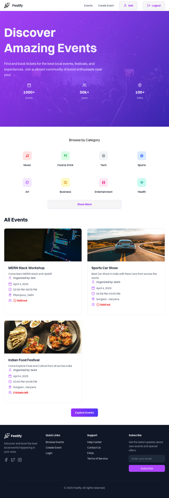
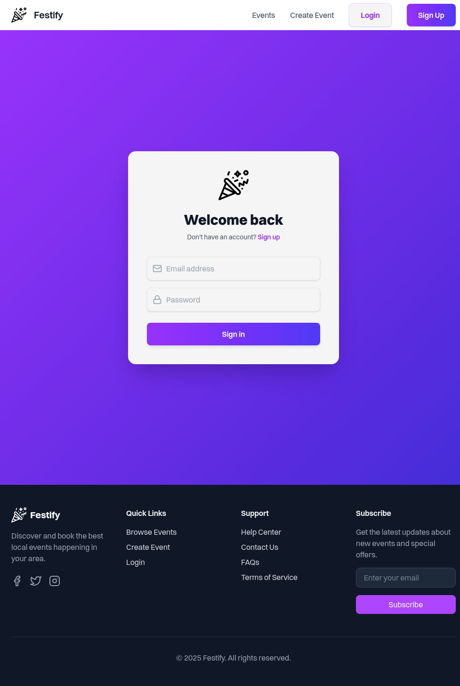
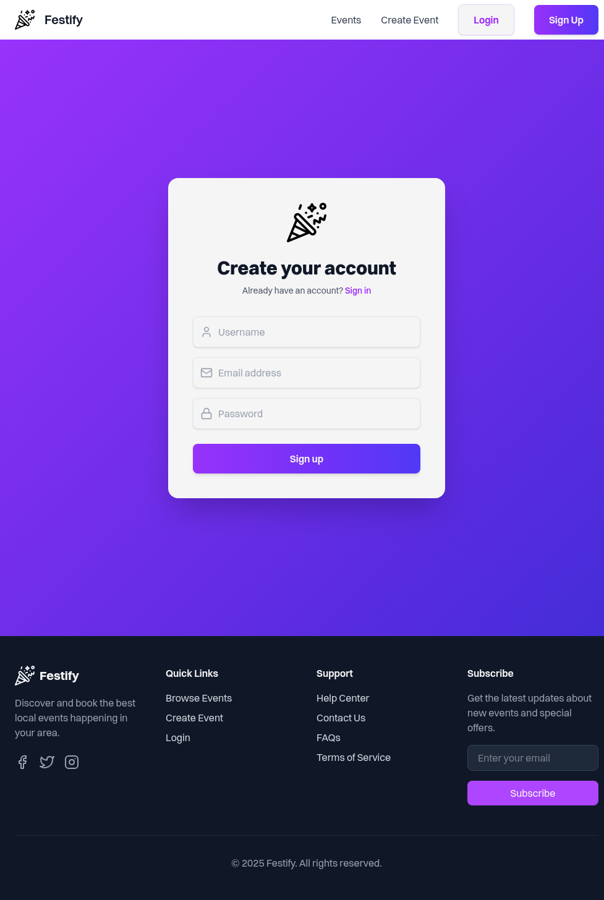
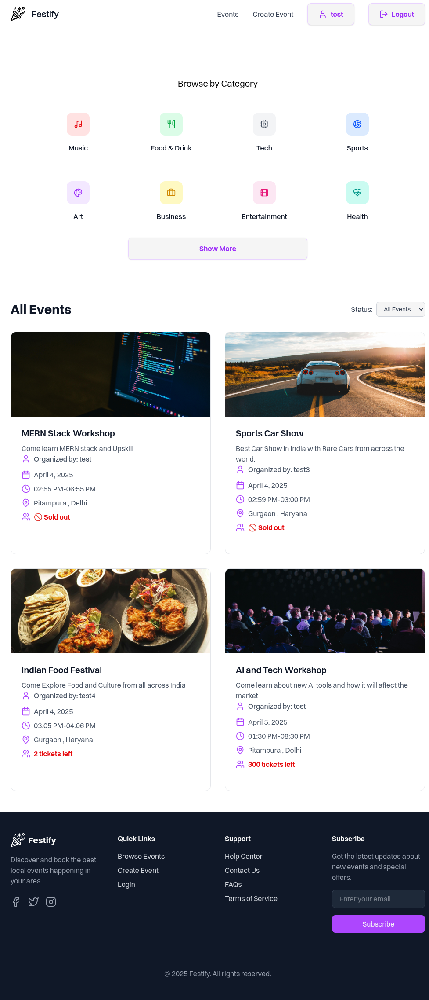
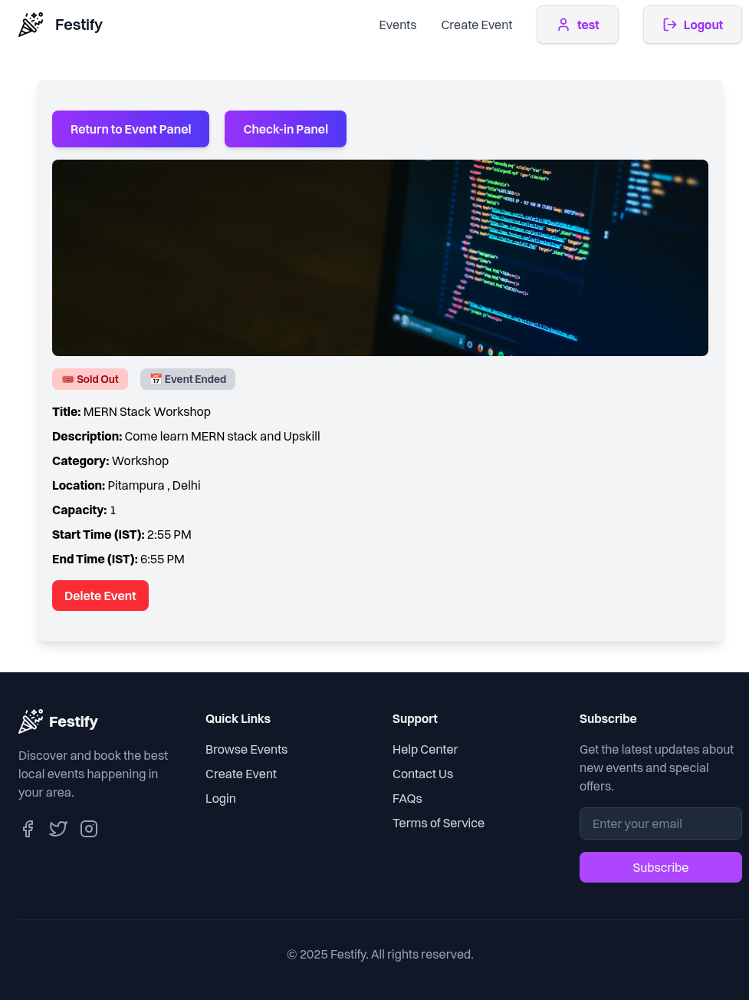
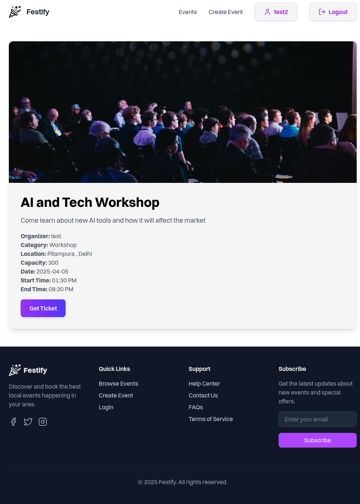
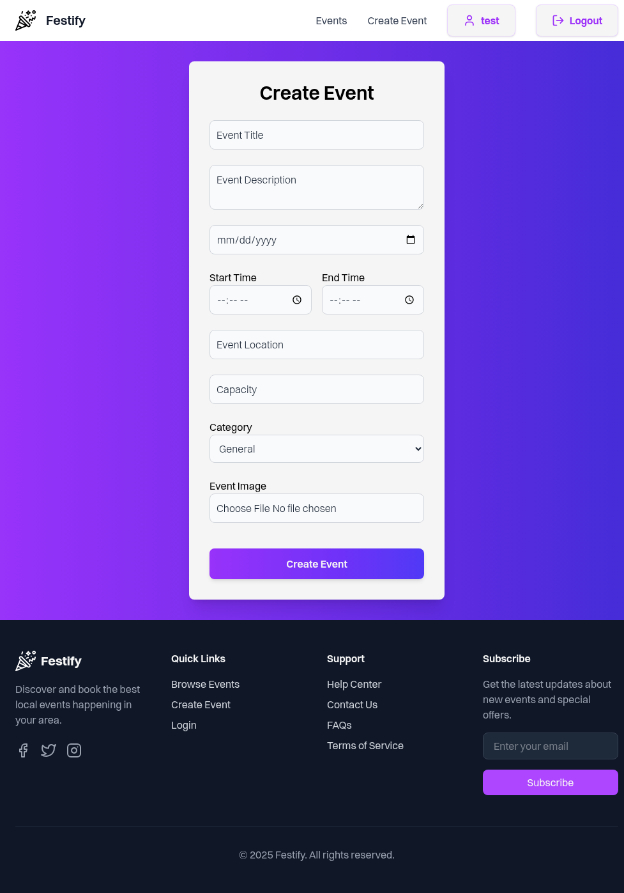
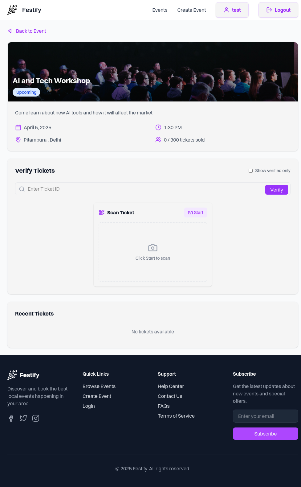
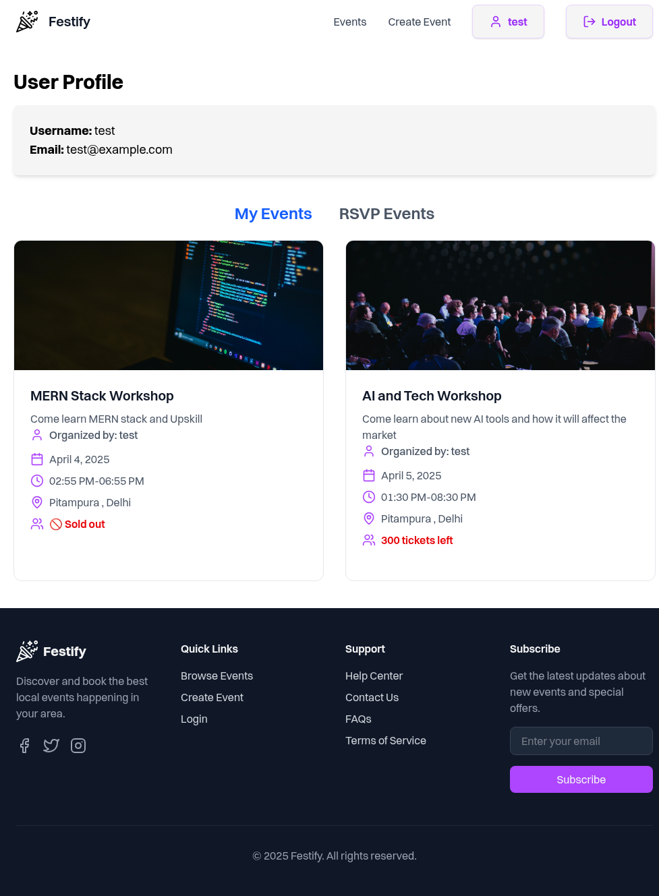
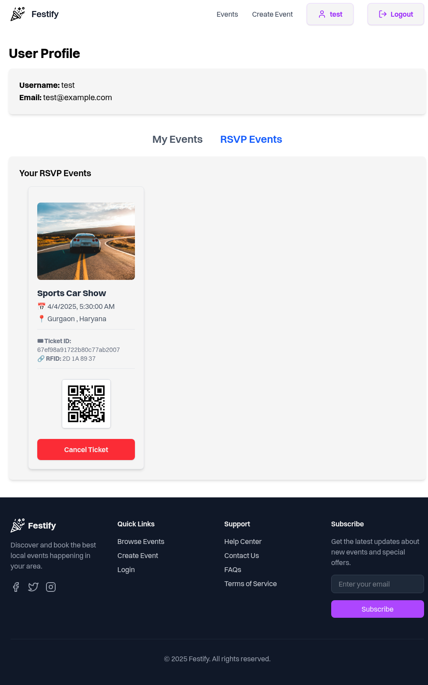

# [🎉 Festify - Local Event Aggregator App](https://festify-tau.vercel.app/)

Live Site : [🎉 Festify](https://festify-tau.vercel.app/)

Festify is a **local event aggregator platform** where users can **discover, create, RSVP, and manage events**. It supports **QR code-based ticketing**, a complete **check-in system for organizers**, and a clean, modern user interface.

---

## 🚀 Features

- 🔐 **JWT Authentication** for secure login/signup
- 🗓️ **Event Management**: Create, Edit, Delete Events (Organizers)
- 🎟️ **Ticketing System** with **QR Code Generation**
- 📸 **Image Uploads** via **Multer + Cloudinary**
- 🔍 **Event Search & Filter** by category
- 📊 **Organizer Dashboard** with check-ins details
- ✅ **QR Code Scanner** using `Html5Qrcode` for attendee verification
- 🧾 **RSVP Management** in user profile

---

## 🏗️ Tech Stack

| Technology                | Purpose                            |
|---------------------------|-------------------------------------|
| **React.js + Vite**       | Frontend SPA                        |
| **Tailwind CSS**          | Modern UI Styling                   |
| **Node.js + Express.js**  | REST API Backend                    |
| **MongoDB + Mongoose**    | Cloud-based NoSQL Database          |
| **JWT & Bcrypt.js**       | Authentication & Security           |
| **Multer + Cloudinary**   | Image Upload & Storage              |
| **qrcode.react**          | QR Code Generation for Tickets      |
| **Html5Qrcode Scanner**   | QR Code Scanning for Check-ins      |

---

## 📦 Installation & Setup

```bash
# 1️⃣ Clone the repository
git clone https://github.com/your-username/festify.git
cd festify

# 2️⃣ Install backend dependencies
cd backend
npm install

# 3️⃣ Install frontend dependencies
cd ../frontend
npm install

# 4️⃣ Configure environment variables
# Create a `.env` file in the backend directory and add:

MONGO_URI=your_mongodb_uri
JWT_SECRET=your_jwt_secret
CLOUDINARY_CLOUD_NAME=your_cloud_name
CLOUDINARY_API_KEY=your_api_key
CLOUDINARY_API_SECRET=your_api_secret

# Create a .env file in root directory and add:

VITE_API_URL = http://localhost/XXXX

# 5️⃣ Run the app

# Start the backend
cd backend
npm run dev

# Start the frontend
cd ../frontend
npm run dev
```

---

## ✅ Completed Features

### 🔐 Authentication & Authorization
- JWT-based Auth
- Protected Routes

### 🎫 Event & Ticketing
- Event Creation & Editing (Organizers)
- QR Code Ticket Generation on RSVP
- RSVP Tracking in User Profile

### 📊 Organizer Tools
- Dashboard for Event & Attendee Management
- QR Code Scanner for Check-ins (`Html5Qrcode`)
- Manual Ticket ID Check-in Support

### 📸 Media Handling
- Event Image Uploads (Multer + Cloudinary)

---

## 🌍 Deployment

| Platform   | Purpose         |
|------------|-----------------|
| **Vercel** | Frontend Hosting |
| **Railway**| Backend Hosting  |
| **MongoDB Atlas** | Cloud Database |
| **Cloudinary** | Image Hosting |

---

## 🖼️ Screenshots

<table>
  <tr>
    <td><b>Homepage</b></td>
    <td><b>Login Page</b></td>
    <td><b>Signup Page</b></td>
  </tr>
  <tr>
    <td></td>
    <td></td>
    <td></td>
  </tr>

  <tr>
    <td><b>Events Page</b></td>
    <td><b>Event Details</b></td>
    <td><b>Single Event (Event ID)</b></td>
  </tr>
  <tr>
    <td></td>
    <td></td>
    <td></td>
  </tr>

  <tr>
    <td><b>Create Event</b></td>
    <td><b>Check-in Panel</b></td>
    <td><b>User Profile 1</b></td>
  </tr>
  <tr>
    <td></td>
    <td></td>
    <td></td>
  </tr>

  <tr>
    <td><b>User Profile 2</b></td>
  </tr>
  <tr>
    <td></td>
  </tr>
</table>
---

## 📡 API Documentation

### 🔐 Auth Routes
- `POST /api/auth/signup` – Register a new user
- `POST /api/auth/login` – Login and get JWT token
- `POST /api/auth/logout` – Logout user
- `GET /api/auth/me` – Get current user info (Requires Auth)
- `GET /api/auth/protected` – Test protected route (Requires Auth)

---

### 👤 User Routes
- `GET /api/users/:id` – Get user by ID
- `GET /api/users/:id/rsvps` – Get events RSVP’d by the user

---

### 🗓 Event Routes
- `POST /api/events` – Create a new event (Organizer only)
- `GET /api/events` – Get all events (supports filtering)
- `GET /api/events/:id` – Get single event by ID
- `PUT /api/events/:id` – Update an event (Organizer only)
- `DELETE /api/events/:id` – Delete an event (Organizer only)
- `GET /api/events/my-events` – Get events created by current user
- `GET /api/events/user` – Alias to get user’s own events
- `GET /api/events/category/:category` – Filter events by category

---

### 🎟️ Ticket & Check-in Routes
- `POST /api/tickets/book` – Book a ticket for an event (Requires Auth)
- `GET /api/tickets/my-tickets` – Get all tickets booked by logged-in user
- `GET /api/tickets/event/:eventId` – Get all tickets for a specific event
- `POST /api/tickets/checkInTicket` – Check in a ticket using QR code or ticket ID
- `POST /api/tickets/verify` – Verify a ticket (Organizer only)
- `DELETE /api/tickets/cancel/:ticketId` – Cancel a ticket (Requires Auth)

---

## 📌 Upcoming Features

- ✅ Ticket Check-in History for Organizers
- 🔔 In-App & Email Notifications
- 📆 Filter Events by Date/Time
- 🛡️ Admin Reporting/Moderation Tools
- 📍 Location-based Event Discovery
- 
---

## 🤝 Contributing

Have suggestions or ideas?  
Fork the repo, create a feature branch, and open a pull request.

---

## 📬 Contact

Found a bug or need help?  
Open an issue on [GitHub](https://github.com/your-username/festify/issues)

---

> Built with ❤️ using the MERN Stack.
