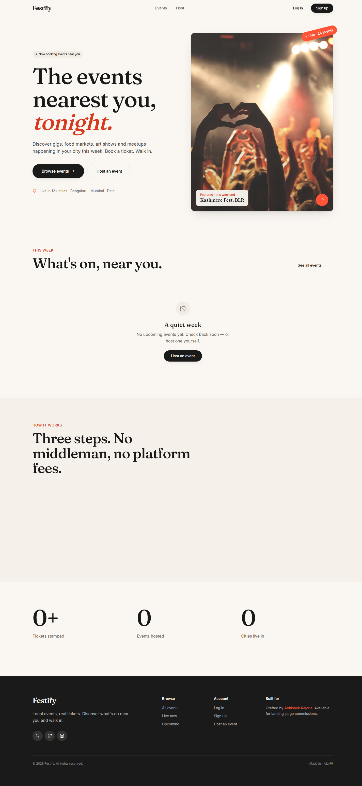
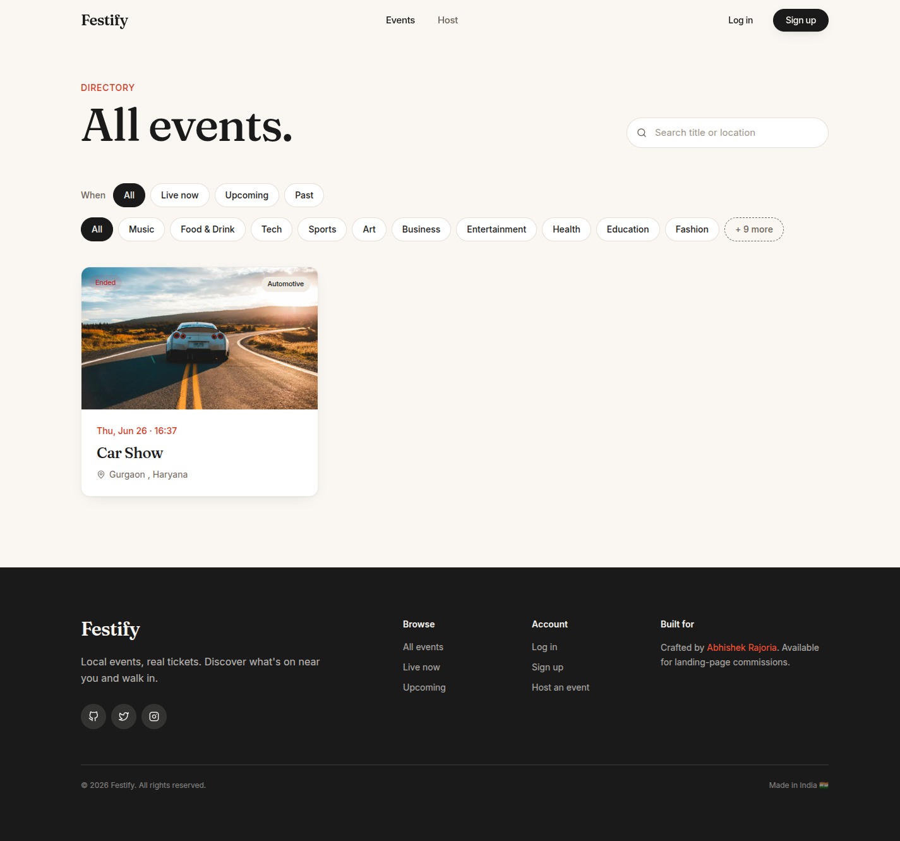
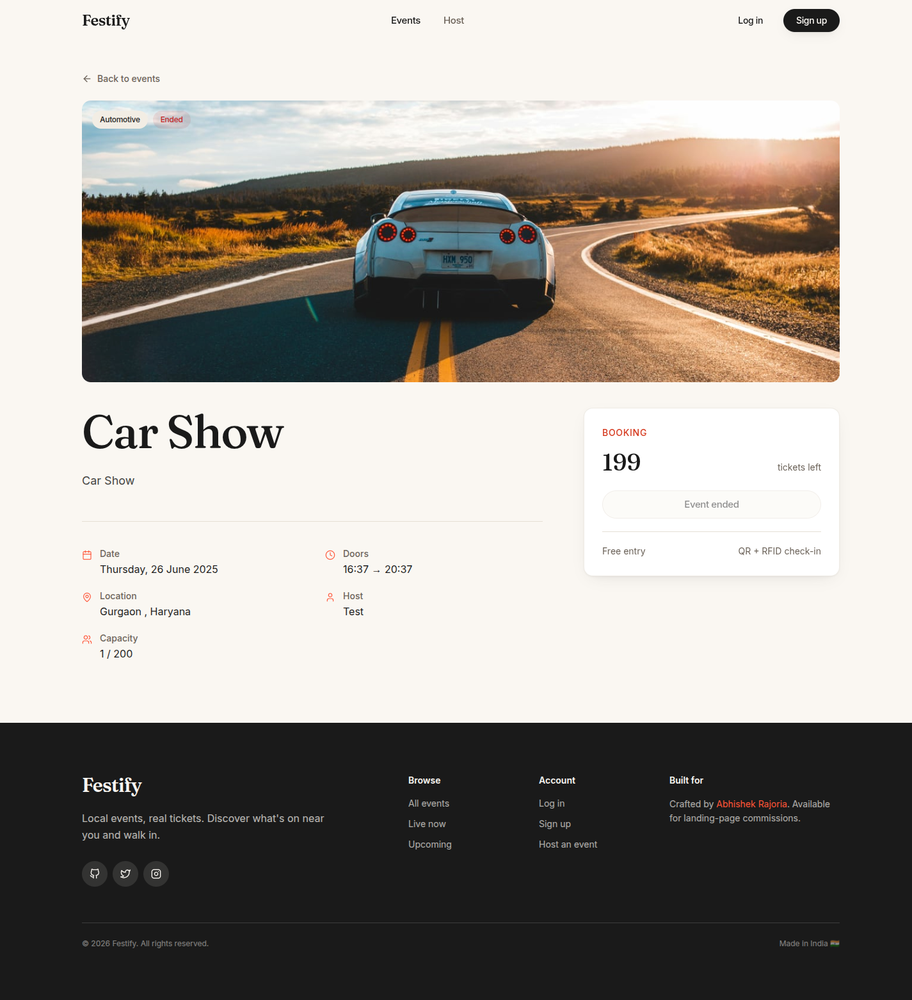
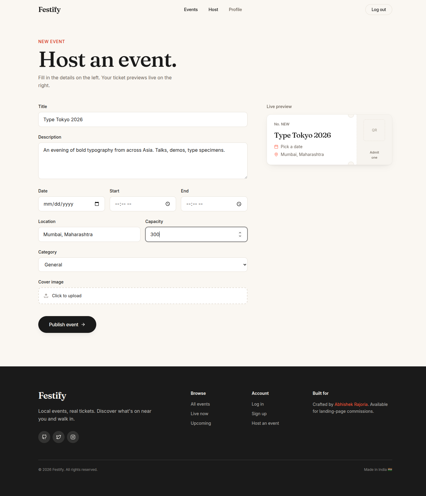
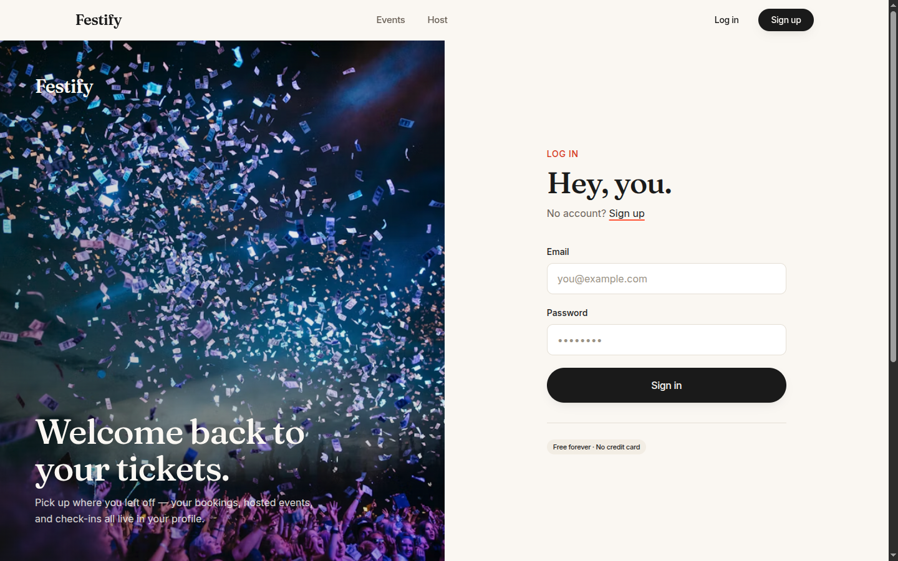
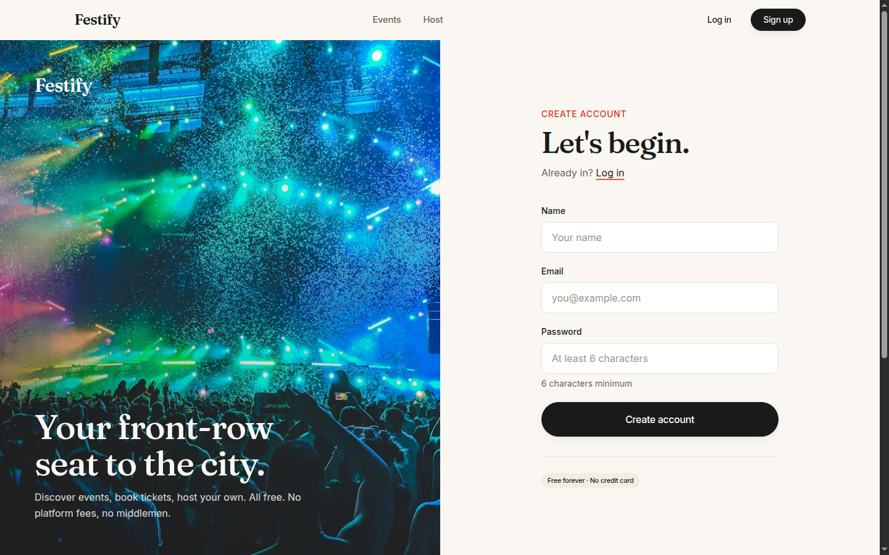
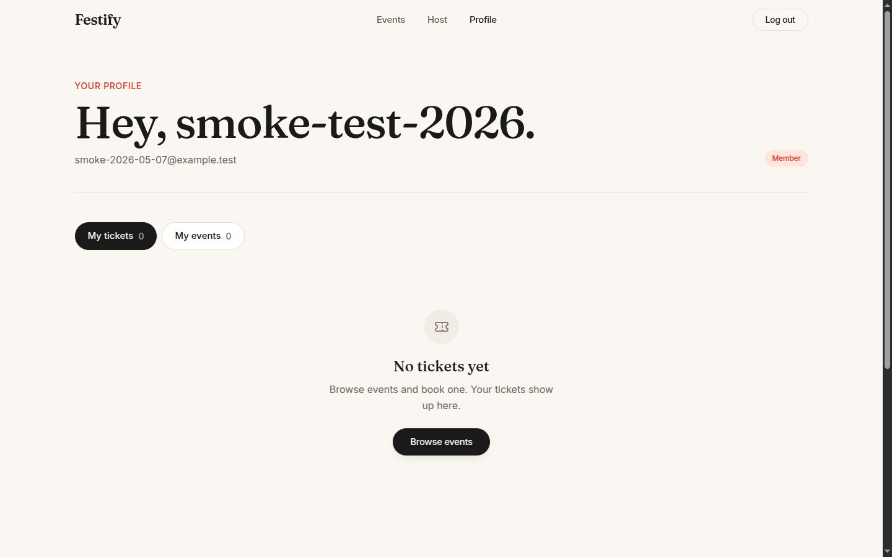

# Festify

> **Local events, real tickets, no nonsense check-in.**
> Discover gigs, food markets, art shows and meetups happening near you — book a ticket, walk in, scan with QR or RFID.

**Live →** [festify-tau.vercel.app](https://festify-tau.vercel.app/) · **Latest →** `v1`

<p align="center">
  <a href="https://festify-tau.vercel.app/">
    
  </a>
</p>

---

## What it is

A full-stack event aggregator with role-based dashboards (user / organizer / admin), QR-coded ticketing, and an organizer-side check-in station that supports both QR scans and RFID wristbands. Designed and built solo, end-to-end.

## What's interesting under the hood

A few decisions I'd defend in a code review:

- **Single Vercel project, two deploy targets.** The Vite frontend and the Express backend live in the same repo. `api/index.js` wraps the entire Express app as a serverless function — same origin as the SPA, so cookies work without `sameSite=none` gymnastics.
- **Mongoose connection caching for serverless.** A `global._mongoose` cache keeps the DB connection warm across function invocations, avoiding a fresh handshake on every request.
- **Backwards-compatible cookie auth.** The login endpoint sets an `httpOnly`, `SameSite=Lax`, 7-day cookie *and* returns a Bearer token in the body. The auth middleware reads cookie first, falls back to `Authorization` header. Migrating off legacy localStorage clients was a non-event.
- **TanStack Query everywhere.** Every page that talks to the API uses `useQuery` / `useMutation`. No bespoke loading/error/success state machines. ~200 lines of boilerplate gone vs. the original.
- **Editorial design system.** A 12-component UI library (`src/components/ui/*`) built with `class-variance-authority`. Fraunces serif headlines + Inter body, warm cream/coral palette, photo-led layouts. Consistent across all 11 pages.

## Design language

| | |
|---|---|
| **Display type** | Fraunces Variable (serif) — soft optical sizes, italic for accents |
| **Body type** | Inter Variable — readable at small sizes |
| **Mono** | Geist Mono — for ticket IDs and RFID strings only |
| **Palette** | Ink `#1A1A1A` · Paper `#FAF7F2` · Coral `#FF5436` · Muted `#6B6258` |
| **Motion** | Framer Motion — scroll-reveals, hover lifts, count-up tickers, ticket-press feedback |
| **References** | lu.ma · Resident Advisor · Pitchfork · It's Nice That |

## Stack

| Layer | Choice |
|---|---|
| Frontend | React 19 + Vite + Tailwind v4 |
| Data fetching | TanStack Query |
| Animation | Framer Motion |
| Backend | Express 4 (deployed as a Vercel serverless function) |
| Database | MongoDB Atlas + Mongoose |
| Auth | JWT (httpOnly cookie + Bearer fallback) |
| Image hosting | Cloudinary (direct browser → Cloudinary upload, backend stores `public_id`) |
| QR | `qrcode` (server) + `html5-qrcode` (scanner) |
| Hosting | Vercel (frontend SPA + `/api/*` serverless function) |

## Architecture

```
                ┌──────────────────────────────────────────────┐
                │            festify-tau.vercel.app            │
                │                                              │
   browser ───▶ │   ┌──────────────┐    ┌──────────────────┐   │
                │   │  Vite SPA    │    │  Express on      │   │
                │   │  /index.html │    │  /api/* function │   │
                │   └──────────────┘    └────────┬─────────┘   │
                └────────────────────────────────┼─────────────┘
                                                 │
                            ┌────────────────────┼────────────────────┐
                            ▼                    ▼                    ▼
                     MongoDB Atlas         Cloudinary           (RFID HW, opt.)
                   (cached connection)   (public_id only)        ESP8266 + RC522
```

Same origin keeps the cookie story simple and removes the cross-origin preflight on every API call.

## Screenshots

<table>
  <tr>
    <td align="center"><b>Homepage</b></td>
    <td align="center"><b>Events directory</b></td>
  </tr>
  <tr>
    <td></td>
    <td></td>
  </tr>

  <tr>
    <td align="center"><b>Event detail</b></td>
    <td align="center"><b>Host an event (live ticket preview)</b></td>
  </tr>
  <tr>
    <td></td>
    <td></td>
  </tr>

  <tr>
    <td align="center"><b>Log in</b></td>
    <td align="center"><b>Sign up</b></td>
  </tr>
  <tr>
    <td></td>
    <td></td>
  </tr>

  <tr>
    <td align="center"><b>User profile</b></td>
    <td></td>
  </tr>
  <tr>
    <td></td>
    <td></td>
  </tr>
</table>

## Demos

| | |
|---|---|
| **Walkthrough** | https://github.com/user-attachments/assets/85308566-21fa-486d-8124-13ad2575e04b |
| **QR check-in** | https://github.com/user-attachments/assets/c9fe9f42-945a-41ee-9662-485db62ea4b1 |
| **RFID + ESP8266** | https://github.com/user-attachments/assets/f9a34c16-8557-4085-854f-82331d2da0bb |

## Local setup

```bash
git clone https://github.com/Abhishek1334/Festify.git
cd Festify
npm install
cd backend && npm install && cd ..
```

Create two `.env` files:

```bash
# Festify/.env  (frontend)
VITE_API_URL=http://localhost:5000
VITE_CLOUDINARY_CLOUD_NAME=your_cloud_name

# Festify/backend/.env  (backend)
NODE_ENV=development
PORT=5000
MONGO_URI=mongodb+srv://<user>:<pass>@<cluster>.mongodb.net/festify
JWT_SECRET=any_long_random_string
CLOUDINARY_CLOUD_NAME=your_cloud_name
CLOUDINARY_API_KEY=your_api_key
CLOUDINARY_API_SECRET=your_api_secret
```

Run both:

```bash
# terminal 1 — Vite frontend on :5173
npm run dev

# terminal 2 — Express backend on :5000
cd backend && npm run dev
```

## Deploy

Deployment guides live at [`docs/deploy/`](./docs/deploy/):

- [`vercel-backend.md`](./docs/deploy/vercel-backend.md) — recommended. Frontend + backend both on Vercel, single dashboard.
- [`koyeb.md`](./docs/deploy/koyeb.md) — fallback. Backend on Koyeb (Dockerfile + free tier).

The repo is wired for the Vercel path out of the box (`api/index.js`, `vercel.json`, `backend/Dockerfile` for the alternative).

## API reference

All routes live under `/api/*`. Auth-required routes accept either the `token` cookie or an `Authorization: Bearer <jwt>` header.

### Auth — `/api/auth`

| Method | Path | Auth | Description |
|---|---|---|---|
| `POST` | `/signup` | — | Register; sets `token` cookie + returns user + bearer token |
| `POST` | `/login` | — | Log in; sets `token` cookie + returns user + bearer token |
| `POST` | `/logout` | — | Clears `token` cookie |
| `GET` | `/me` | required | Returns the authenticated user |

### Events — `/api/events`

| Method | Path | Auth | Description |
|---|---|---|---|
| `GET` | `/` | — | List all events |
| `GET` | `/:id` | — | Single event |
| `GET` | `/category/:category` | — | Filter by category |
| `GET` | `/my-events` | required | Events created by the caller |
| `POST` | `/` | required | Create event (multipart, `image` file) |
| `PUT` | `/:id` | organizer | Update event |
| `DELETE` | `/:id` | organizer | Delete event (also removes Cloudinary asset and tickets) |

### Tickets — `/api/tickets`

| Method | Path | Auth | Description |
|---|---|---|---|
| `POST` | `/book` | required | Book a ticket; returns ticket with QR data URL |
| `GET` | `/my-tickets` | required | All tickets booked by the caller |
| `GET` | `/event/:eventId` | required | All tickets for an event (organizer view) |
| `POST` | `/checkInTicket` | organizer/admin | Mark ticket checked in (used by QR scanner) |
| `POST` | `/verify` | organizer | Verify a ticket (manual + RFID lookup) |
| `PUT` | `/update/:ticketId` | required | Assign / update RFID tag |
| `DELETE` | `/cancel/:ticketId` | required | Cancel ticket (owner-only) |

### Admin — `/api/admin`

| Method | Path | Auth | Description |
|---|---|---|---|
| `GET` | `/users` | admin | List all users |
| `GET` | `/events` | admin | List all events |
| `DELETE` | `/events/:eventId` | admin | Delete any event |

## What this project is and isn't

It's a working full-stack app and a sample of the kind of frontend work I take on commissions for. It's deliberately scoped — no payments, no real-time updates, no mobile app. The depth is in the design system, the cookie auth, and the serverless deploy story, not feature breadth.

If you found a bug or want to talk about a landing-page or product UI commission: [open an issue](https://github.com/Abhishek1334/Festify/issues) or reach me via [my GitHub](https://github.com/Abhishek1334).

---

Built by [Abhishek Rajoria](https://github.com/Abhishek1334) · Made in India 🇮🇳
